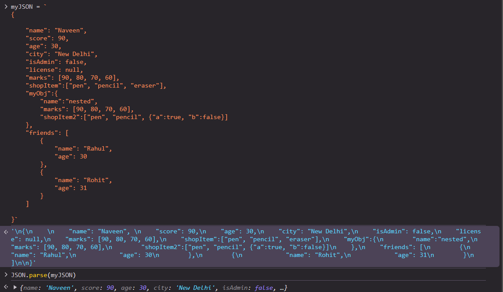
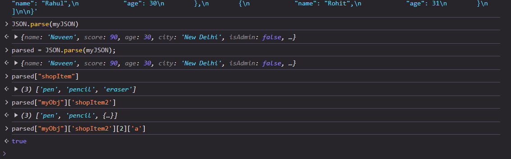

# JSON

[JSON Tutorial](https://youtu.be/whNFPBEI-wM?si=KgFoxhPV3eoAgp8z)
[JSON Documentation](https://developer.mozilla.org/en-US/docs/Web/JavaScript/Reference/Global_Objects/JSON)

## What is JSON , Why is it is used, Where it is used, its significance.

**JSON (JavaScript Object Notation)** is a lightweight data-interchange format that is easy for humans to read and write and easy for machines to parse and generate. It is based on a subset of JavaScript but is widely used across various programming languages due to its simplicity and universal format.

### Key Concepts of JSON:
- **Data Representation**: JSON represents data as key-value pairs and ordered lists. The data structure includes objects (`{}`) and arrays (`[]`).
  - An object is a collection of key-value pairs:  
    Example: `{"name": "Alice", "age": 25}`
  - An array is an ordered list of values:  
    Example: `["apple", "banana", "cherry"]`

### Why is JSON Used?
1. **Human-readable**: JSON is easy for humans to understand and write.
2. **Lightweight**: It is minimal in size compared to other formats like XML, making data transmission faster.
3. **Language-agnostic**: Although derived from JavaScript, JSON is supported by most programming languages (e.g., Python, Java, C#, etc.).
4. **Interoperability**: Its simple structure allows data to be easily exchanged between different systems and platforms.
5. **Widely supported**: Modern APIs, web services, and tools widely adopt JSON for data communication.

### Where is JSON Used?
1. **Web Development**: 
   - **APIs**: JSON is the standard format for data exchange in RESTful APIs between client and server.
   - **AJAX**: Asynchronous JavaScript requests often return JSON data from the server, making it easy to dynamically update web pages without refreshing.
   
2. **Configuration Files**: JSON is commonly used in configuration files (e.g., `.json` files) for applications and services due to its simple and structured format.

3. **Data Storage**: It is used in databases such as NoSQL databases like MongoDB, CouchDB, which store data in JSON-like formats (BSON in MongoDB).

4. **Mobile App Development**: JSON is commonly used in both Android and iOS development to send and receive data from servers or APIs.

### Significance of JSON:
- **Standardization**: JSON provides a standardized way to structure and transfer data.
- **Efficiency**: Its lightweight structure makes it more efficient than other formats like XML in terms of parsing speed and file size.
- **Interconnectivity**: JSON allows for seamless interaction between different platforms, software, and systems, making it a backbone of modern web development and APIs.

## Why we shifted from XML to JSON ?

The shift from **XML (eXtensible Markup Language)** to **JSON (JavaScript Object Notation)** as a preferred data interchange format happened for several reasons, primarily driven by the need for simplicity, performance, and ease of use. Here's a breakdown of the main factors behind the shift:

### 1. **Simplicity and Readability**
   - **JSON**: JSON has a simple, lightweight structure made up of key-value pairs. It's human-readable, easy to understand, and concise.
     - Example:
       ```json
       {
         "name": "John",
         "age": 30
       }
       ```
   - **XML**: XML, on the other hand, uses a more verbose and complex format with opening and closing tags, making it harder to read and less compact.
     - Example:
       ```xml
       <person>
         <name>John</name>
         <age>30</age>
       </person>
       ```

   **Why the shift?** JSON’s minimal syntax makes it easier for developers to write, read, and parse, reducing potential errors and development time. XML’s verbosity can make files large and hard to manage.

### 2. **Data Size and Efficiency**
   - **JSON**: JSON is more lightweight than XML because it uses fewer characters and no redundant tags, leading to faster data transfer over networks.
   - **XML**: XML files are often larger because they include closing tags for every opening tag, increasing the size of the payload significantly.

   **Why the shift?** In modern web applications where speed and bandwidth are crucial, JSON’s compact nature means faster data transfers and lower bandwidth consumption.

### 3. **Ease of Parsing**
   - **JSON**: JSON is natively supported by most programming languages and libraries. In JavaScript, JSON can be parsed easily with `JSON.parse()` and converted to a string using `JSON.stringify()`.
   - **XML**: Parsing XML requires more complex libraries and additional processing steps. XML parsers often require writing schemas (e.g., XSD) and handling attributes, elements, and namespaces.

   **Why the shift?** JSON’s native support in JavaScript (the dominant language for web development) and ease of parsing in other languages made it the more developer-friendly choice.

### 4. **Data Structure Simplicity**
   - **JSON**: JSON supports a simple and direct data structure with objects (key-value pairs) and arrays. It doesn’t require attributes or namespaces, which can complicate data.
   - **XML**: XML can be more complex with nested elements, attributes, namespaces, and mixed content, which are rarely needed for simple data exchange.

   **Why the shift?** For most data interchange needs, such as APIs, JSON provides all the required structures without the overhead and complexity that XML introduces.

### 5. **Native JavaScript Support**
   - **JSON**: JSON was derived from JavaScript, making it the natural choice for JavaScript-based web applications. JavaScript can natively handle JSON without needing extra libraries.
   - **XML**: XML requires additional processing and parsing even in JavaScript, which adds extra steps for developers working in web environments.

   **Why the shift?** With the rise of JavaScript as the dominant language for web development (especially with the popularity of AJAX and RESTful services), JSON’s native compatibility gave it a significant edge over XML.

### 6. **Interoperability and Compatibility**
   - **JSON**: JSON is widely supported across all major programming languages (e.g., Python, Java, Ruby, Go), making it a universal format for data exchange.
   - **XML**: Although XML is also supported in various languages, the complexity of its structure makes it harder to integrate with some systems, especially in modern lightweight environments like mobile and cloud applications.

   **Why the shift?** The simplicity and widespread adoption of JSON as a universal standard for data interchange helped it gain traction across different platforms, including web, mobile, and cloud applications.

### 7. **Use Case Flexibility**
   - **XML**: XML was originally designed for document storage and management, not just for data interchange. It is powerful for complex document structures but often overkill for simple API communication.
   - **JSON**: JSON was designed purely for lightweight data exchange, which is the primary use case for modern web APIs.

   **Why the shift?** JSON’s design is well-suited to the specific needs of API-based data communication, while XML’s versatility can introduce unnecessary complexity for this task.

### Conclusion: Why We Shifted to JSON
- **Simplicity**: JSON’s minimalistic and intuitive structure makes it easier to use and maintain.
- **Efficiency**: Smaller data sizes and faster parsing result in better performance, especially for web and mobile applications.
- **Native Web Support**: JSON is naturally suited to web environments, making it the obvious choice for modern web development.
- **Widespread Adoption**: JSON became a de facto standard for APIs, supported by major web services, mobile applications, and databases.

While XML is still used in certain contexts (e.g., document storage, configuration files), JSON’s dominance in APIs and web development stems from its efficiency, simplicity, and native web compatibility.

## Comments 
1. these contains the data in the form of key value pair
2. JSON is a text format that is completely language independent but uses conventions that are familiar to programmers of the C-family of languages, including C, C++, C#, Java, JavaScript, Perl, Python, and many others. These properties make JSON an ideal data-interchange language.
3. JSON is built on two structures:
    i.A collection of name/value pairs. In various languages, this is realized as an object, record, struct, dictionary, hash table, keyed list, or associative array.
    ii.An ordered list of values. In most languages, this is realized as an array, vector, list, or sequence.
4. We cannot use single quotes in the format of JSON.

### JSON in console

